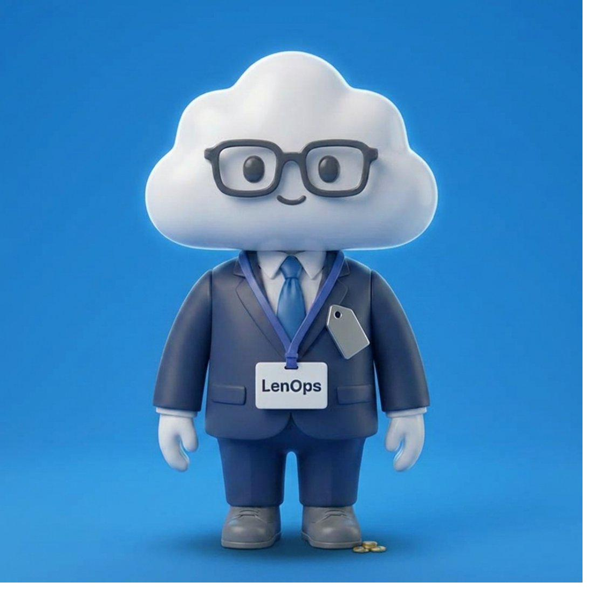

<p align="center">
  
</p>

<h1 align="center">FinOps a lo LenOps</h1>

<p align="center">
  <em>Mi forma de entender FinOps: clara, práctica y sin humo.</em>
</p>

<p align="center">
  <a href="https://creativecommons.org/licenses/by-nc-sa/4.0/">
    
  </a>
  
  
</p>

---

## Qué es esto

Una serie de artículos técnicos sobre FinOps. Sin teoría vacía. Sin buzzwords. Solo lo que sirve cuando tienes una factura cloud delante y necesitas tomar decisiones.

Cada artículo parte de documentación oficial de los proveedores cloud (AWS, Azure, GCP, OCI) y la aterriza en escenarios reales. El tipo de escenarios que nadie te cuenta en los webinars pero que aparecen el día que revisas el Cost Explorer.

FinOps no va de apagar máquinas ni de perseguir descuentos.
Va de convertir el caos del cloud en información clara, accionable y con sentido económico.

---

## Artículos publicados

| # | Artículo | Cloud | Tema central |
|---|----------|-------|--------------|
| 01 | [Savings Plans vs Reserved Instances en AWS](articles/01-savings-plans-vs-reserved-instances-aws.md) | AWS | El error que nadie te cuenta hasta que lo ves en la factura |
| 02 | [Savings Plans vs Reservations en Azure](articles/02-savings-plans-vs-reservations-azure.md) | Azure | El error más caro al comprar reservas |

> Los artículos se publican sin calendario fijo. Cuando hay algo que valga la pena decir, se dice.

---

## Quién es LenOps

No soy un gurú. No soy un influencer. Soy un operador.

15+ años en infraestructura de telecomunicaciones en Tier-1 (Claro, Movistar, Netlife). He visto facturas reales, he peleado con reservas mal dimensionadas y he tenido que explicar sobrecostes a negocio.

Ahora trabajo en FinOps. Y escribo lo que me habría gustado leer cuando empecé: artículos que van al grano, respaldados por documentación, sin humo.

---

## Qué cubre esta serie

- **Commitment discounts:** Savings Plans, Reserved Instances, CUDs. Cuándo comprar, cuándo no, y qué pasa cuando te equivocas.
- **Visibilidad de costes:** Tagging, cost allocation, FOCUS. Lo que necesitas antes de optimizar nada.
- **Optimización real:** Rightsizing, idle resources, arquitectura. Lo que mueve la aguja de verdad.
- **Gobernanza:** Budgets, alertas, policies. El marco que evita que todo se desmadre.
- **Multi-cloud:** AWS, Azure, GCP, OCI. Porque pocos entornos son de una sola nube.

---

## Estructura del repositorio

```
FinOps_a_lo_LenOps/
├── README.md
├── articles/
│   ├── 01-savings-plans-vs-reserved-instances-aws.md
│   └── 02-savings-plans-vs-reservations-azure.md
├── assets/
│   └── LenOps_modo_FinOps.png
└── LICENSE
```

---

## Cómo seguir la serie

Cada artículo de GitHub tiene su versión corta en LinkedIn — una pastilla de 180 palabras que resume el insight principal. Si prefieres la versión rápida, sígueme ahí. Si prefieres la profundidad, estás en el sitio correcto.

**LinkedIn:** [LenOps](https://www.linkedin.com/in/TU-PERFIL) *(actualiza con tu URL)*

---

## Contribuir

Esto no es un proyecto colaborativo abierto — es una serie editorial con voz propia. Pero si encuentras un error técnico, un dato desactualizado o una fuente mal referenciada, abre un issue. Lo reviso y corrijo.

---

## Licencia

Este trabajo está bajo licencia [Creative Commons Attribution-NonCommercial-ShareAlike 4.0 International (CC BY-NC-SA 4.0)](https://creativecommons.org/licenses/by-nc-sa/4.0/).

Puedes compartir y adaptar el contenido siempre que:
- Des crédito al autor
- No lo uses con fines comerciales
- Distribuyas derivados bajo la misma licencia

---

<p align="center">
  <strong>En cloud, el coste no es el enemigo. La falta de información sí.</strong>
</p>
